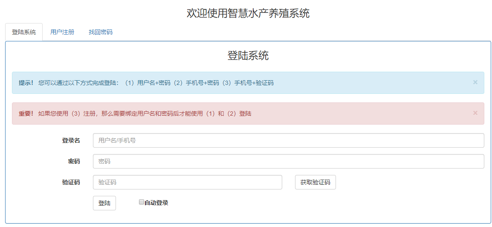
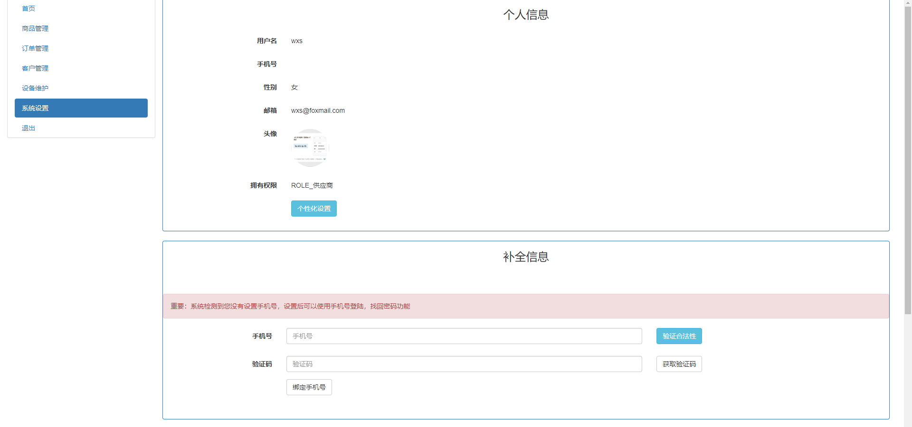
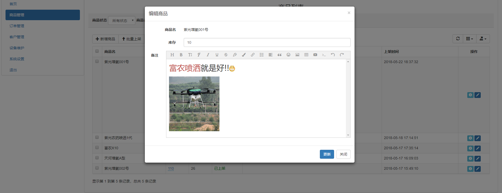
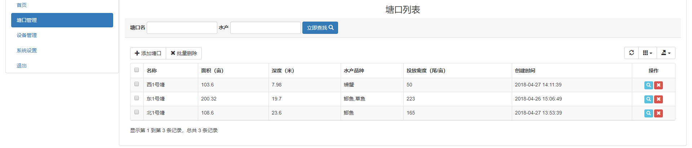
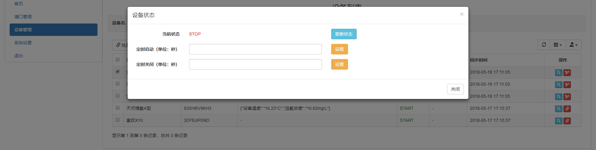

# 智慧水产养殖系统

> SpringBoot 及其相关技术栈的入门实践

## 相关技术

- SpringBoot 2.0
- SpringSecurity
- MyBatis-Plus 2
- ActiveMQ
- 腾讯云短信和对象存储服务

## 起步

1. 执行 `sql/breed.sql` 文件初始化数据库
2. 修改 `application.properties` 配置信息：
   1. `spring.datasource.username` 数据库用户名
   2. `spring.datasource.password` 数据库密码
   3. `logging.file` 日志输出路径，检查是否存在
   4. `tencent.sms` 腾讯云短信相关配置
   5. `cos` 腾讯云对象存储相关配置
   6. `spring.activemq.broker-url` activemq 访问地址
3. 搭建 ActiveMQ 环境，[参考文章](https://blog.csdn.net/yuanlaijike/article/details/79950330)。

### 默认账户

导入SQL后，默认提供以下账户：

- 用户名：wxs，密码：123，角色：供应商
- 用户名：jitwxs，

### 支持功能

1. 支持`用户名密码`和`短信验证码`两种登录逻辑
2. 支持头像上传，采用腾讯云对象存储。
3. 配合` SpringSecurity` 实现鉴权和角色控制。
4. 对于供应商用户，支持：
   1. 对商品进行添加、上架、下架操作，商品描述支持富文本编辑。
   2. 对买家订单进行查看。
   3. 记录所有的买家客户信息，并统计总消费额。
5. 对于普通用户，支持：
   1. 管理自己所有的塘口信息。
   2. 将自己所有的设备动态添加到某一塘口上。
   3. 设置支持远程开关操作。（使用 `ActiveMQ` 模拟实现）

### 截图

登录页：

信息设置页：

供应商订单页：

供应商商品页：

用户塘口页：

用户塘口远程控制：

